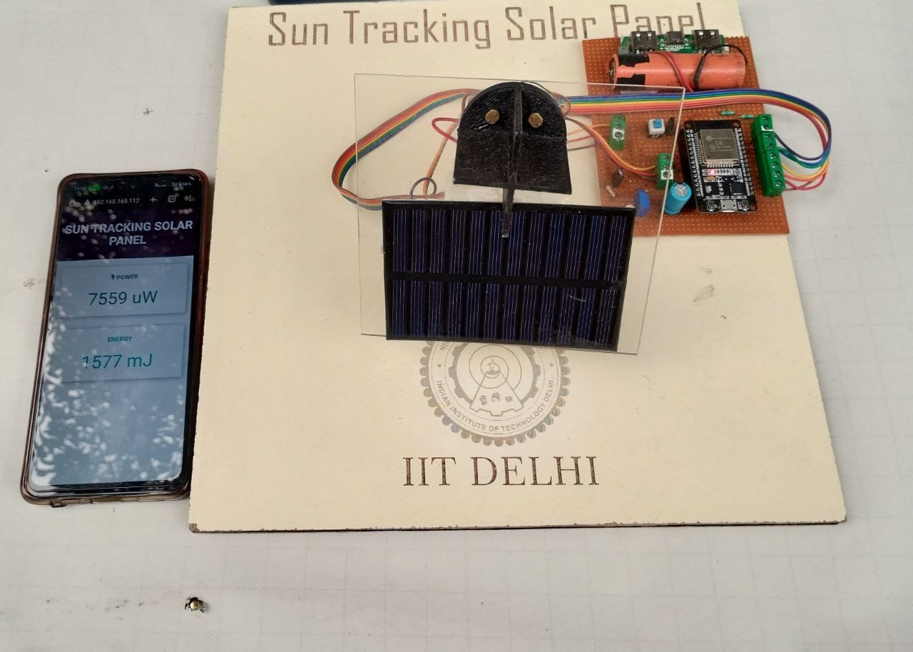
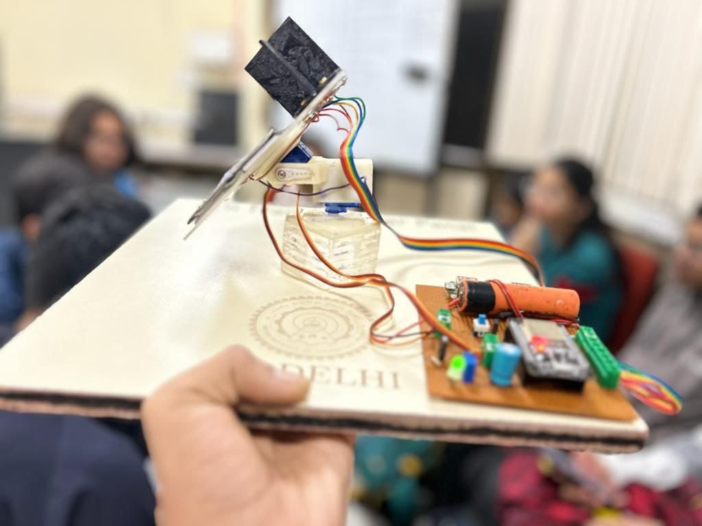
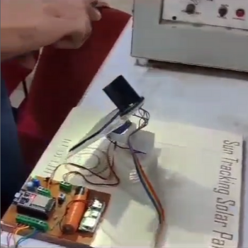
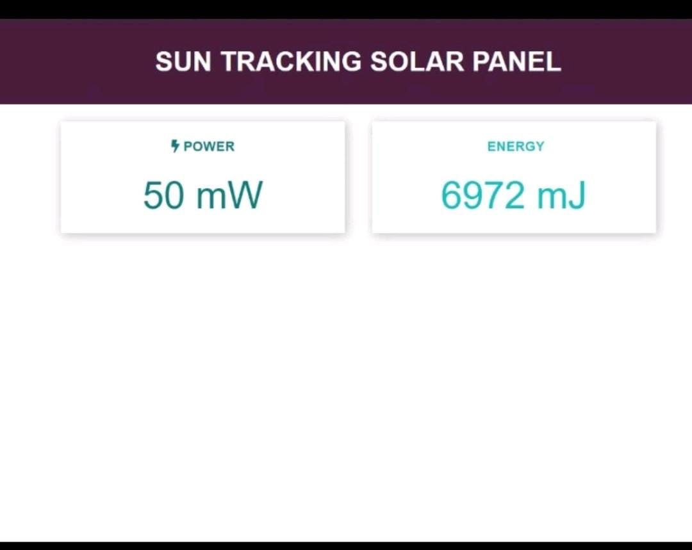

# 🌞 Sun Tracking Solar Panel Project 🌞

## 📜 Overview

This project showcases a solar panel system that **tracks the sun's movement** to optimize energy collection. The system utilizes an **ESP32 microcontroller**, light-dependent resistors (LDRs) calibrated via a voltage divider, and a user-friendly web interface to display current power and total energy stored since operation began. 

**Selected for Open House Event at IIT Delhi on November 4, 2023** 🎉
   
   
  
  \
   

## 🔧 Components Used

- **Microcontroller**: ESP32
- **Light Sensors**: Light Dependent Resistors (LDR)
- **Voltage Divider Circuit**: For calibrating LDRs
- **Additional Hardware**:
  - Laser-cut and engraved components ✂️
  - 3D printed parts 🖨️
  - Soldering components 🔌

---

## ⚙️ Working Principle

### 🎥 Demo Video

  

1. **Light Detection**: The LDRs measure sunlight intensity and adjust the solar panel's orientation to maximize exposure. ☀️
2. **Calibration**: A voltage divider circuit calibrates the LDRs, ensuring accurate readings of light intensity.
3. **Data Monitoring**: The ESP32 hosts a simple web interface that displays:
   - Current power output ⚡
   - Total energy accumulated since the project commenced 📊
4. **Automation**: The system automatically adjusts the panel's angle based on real-time data from the LDRs.

---

## 🌐 Web Interface

- **Features**:
  - Real-time power output monitoring
  - Total energy storage tracking
- **Access**: need to connect with esp32 wifi locally

---

## 🛠️ Fabrication Methods

- **Laser Cutting and Engraving**: Used for creating precise components.
- **3D Printing**: Employed to create custom parts for the structure and housing of the solar panel.
- **Soldering**: For securely assembling electronic components.

---

## 🎯 Conclusion

This sun tracking solar panel project effectively demonstrates how modern technology can enhance solar energy collection. By utilizing simple yet effective sensors and web technologies, this project contributes to sustainable energy solutions. 🌍

---

## 🙏 Acknowledgments

Special thanks to my fellow teamates and IITD staff/faculty for their support and resources.

